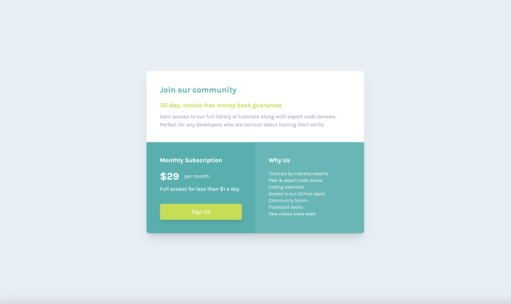

# Frontend Mentor - Single price grid component solution

This is a solution to the [Single price grid component challenge on Frontend Mentor](https://www.frontendmentor.io/challenges/single-price-grid-component-5ce41129d0ff452fec5abbbc). Frontend Mentor challenges help you improve your coding skills by building realistic projects.

## Table of contents

- [Overview](#overview)
  - [The challenge](#the-challenge)
  - [Screenshot](#screenshot)
  - [Links](#links)
- [My process](#my-process)
  - [Built with](#built-with)
  - [What I learned](#what-i-learned)
- [Author](#author)

## Overview

### The challenge

Users should be able to:

- View the optimal layout for the component depending on their device's screen size
- See a hover state on desktop for the Sign Up call-to-action

### Screenshot

### Links

- Solution URL: [https://github.com/maryam-nasir/fm-price-grid-component](https://github.com/maryam-nasir/fm-price-grid-component)
- Live Site URL: [https://maryam-nasir.github.io/fm-price-grid-component](https://maryam-nasir.github.io/fm-price-grid-component)

## My process

### Built with

- Semantic HTML5 markup
- Tailwind CSS
- Flexbox
- Responsive Design

### What I learned

It was a great opportunity to practice my responsive design skills, as I'm not proficient in it too much and would like to practice it a lot!

## Author

- LinkedIn - [Maryam Nasir](https://www.linkedin.com/in/maryam-nasir/)
- Frontend Mentor - [@maryam-nasir](https://www.frontendmentor.io/profile/maryam-nasir)
- Twitter - [@maryamnasir555](https://twitter.com/maryamnasir555)
